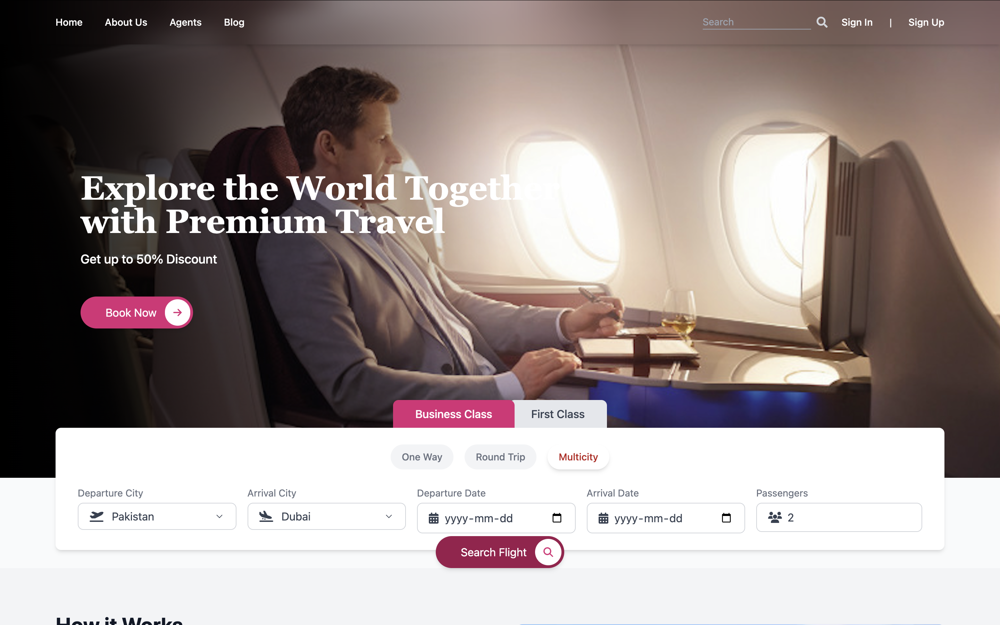
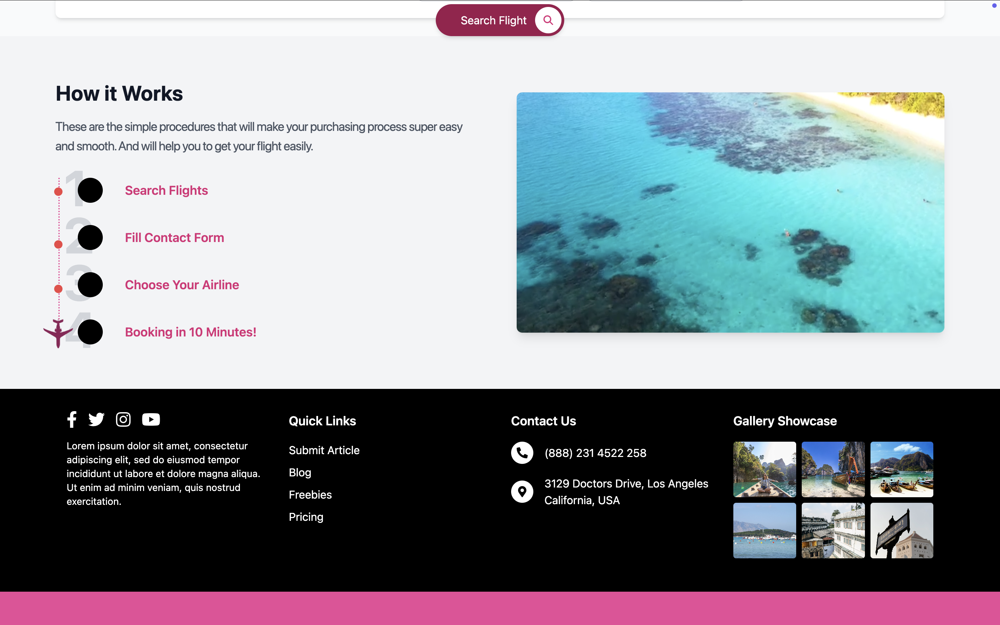
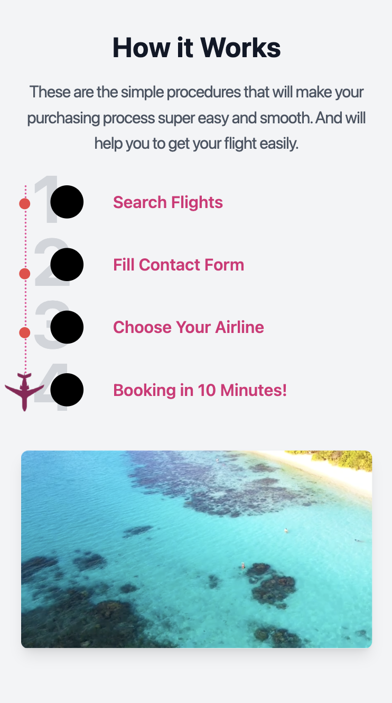
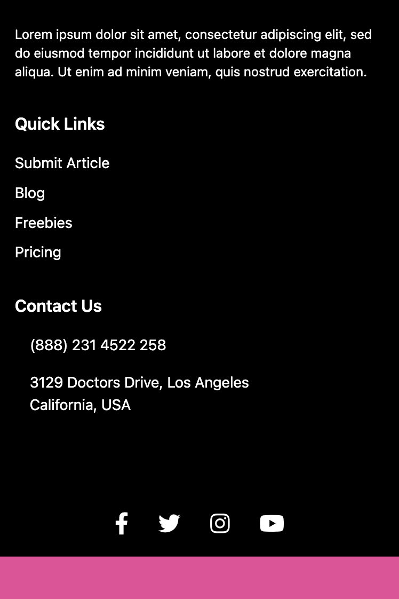

# Frontend UI Design

Designed using **React** and **Tailwind CSS**. The application is **mobile responsive**, ensuring a seamless experience across devices of all screen sizes.

## Technologies

- **React**
- **Tailwind CSS**

## Screenshots

### Desktop View 

  
   

### Mobile View

  
  
  

